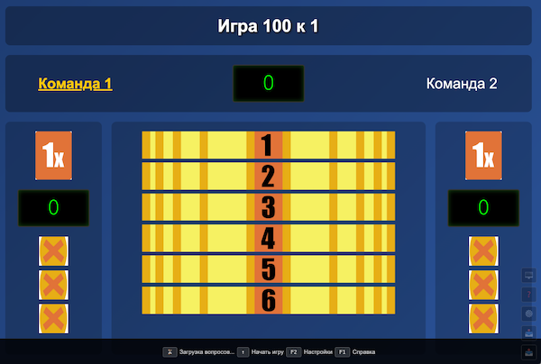
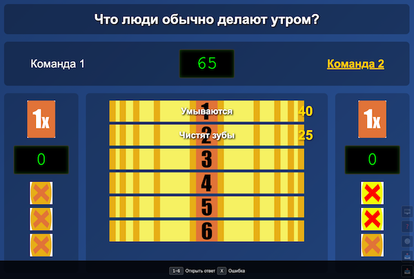
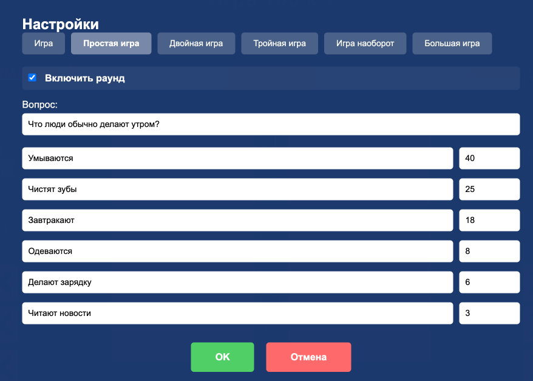
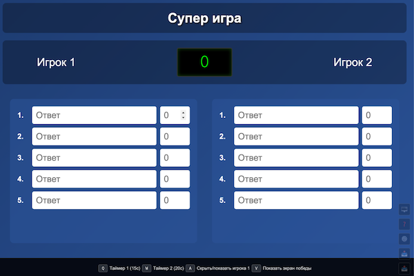

# Игра 100 к 1. Веб версия.

🎮 **[Играть онлайн](https://dontsovcmc.github.io/100_k_1/)** (GitHub Pages)

⚠️ **Важно**: Онлайн версия НЕ сохраняет настройки после перезагрузки страницы. Для сохранения прогресса скачайте игру локально (см. инструкцию ниже).

## Эпилог
В далеком 2011м году я не нашел в интернете ни одной реализации "100 к 1", а устроить праздник на День Рождения очень хотелось. За ночь была написана игра. Параллельно друг проводил опрос среди друзей и подсчитывал результаты. "Кажется я начинаю понимать Избирком..", - писал он мне в 5 утра накануне праздника.
Я старался полностью повторить телевизионную версию.
upd: переписана на веб версию с помощью claude в 2025 г.

## Скриншоты

*Главный экран игры с табло ответов и счётом команд*

*Процесс игры: вопрос, открытые ответы и накопленные очки*

*Редактор вопросов и ответов*

*Режим "Большая игра" для двух игроков*

*Панель управления: полноэкранный режим, справка, настройки, импорт/экспорт*

## Правила игры

Подробное описание правил, раундов и хода игры см. в **[game.md](game.md)**

# Компьютерная версия

## Быстрый старт

### Скачать и играть локально (Рекомендуется)
Для сохранения прогресса и настроек:

1. Скачайте проект с [GitHub](https://github.com/dontsovcmc/100_k_1)
2. Откройте файл `index-prod.html` двойным кликом
3. Готово! Игра работает без интернета.

## Вопросы и ответы
Хранятся ТОЛЬКО на вашем компьютере в json файле. Можно загрузить или сохранить его. В игре есть редактор файла. После изменений скачайте файл на компьютер.

## Настройки игры
Настройки можно менять:
- изменить названия команд;
- включить/выключить уровни (вдруг вы спросили меньше 5 вопросов на улице);
- время размышлений в Обратной игре;
- время ответов 1го и 2го игрока в Супер игре;
- кол-во очков для победы в Супер игре;

## Для разработчиков

Информация о сборке, разработке и архитектуре проекта: **[development.md](development.md)**

## Обратная связь

Создал чат в tg для обсуждения
game_100_k_1

Буду рад, если кто-то разовьет идею и сделает автоматизацию проведения опросов!
Что надо бы доработать:
- дизайн;
- поддержку 2-го экрана для показа органов управления;
- поддержку опросов в GoogleForms или свой сайт;
- шеринг вопросов-ответов;

Пишите в комментариях, если будете где-то проводить игры!
Также приветствуются результаты Ваших опросов.

## Поддержать проект

Если вам понравилась игра и она оказалась полезной, вы можете поддержать автора:

💳 [Поддержать донатом](https://pay.cloudtips.ru/p/cdb246c8)

Ваша поддержка помогает развивать проект!
